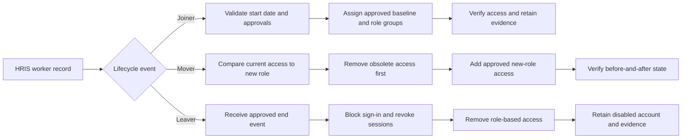
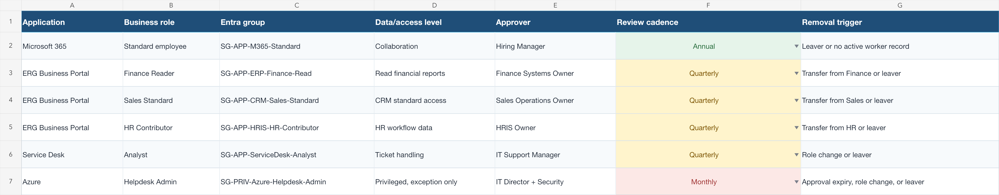
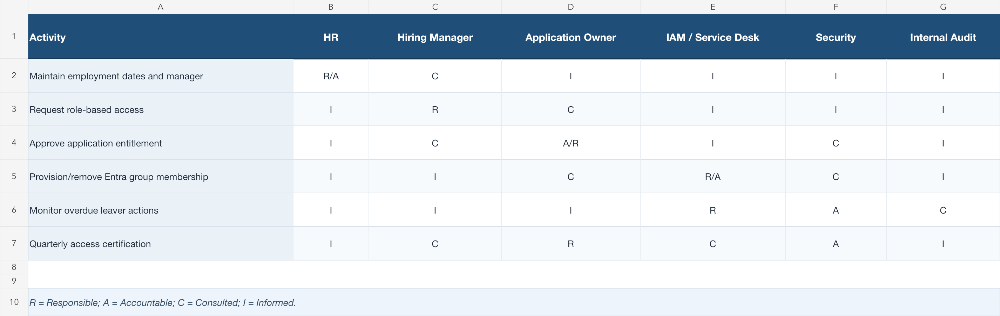
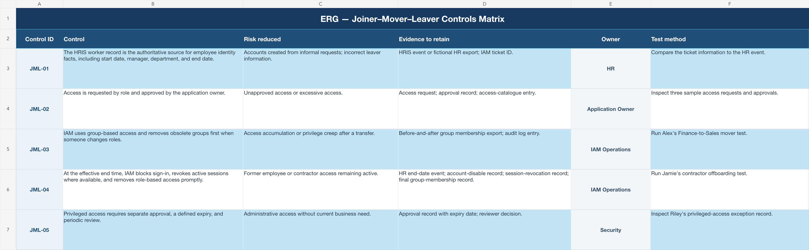
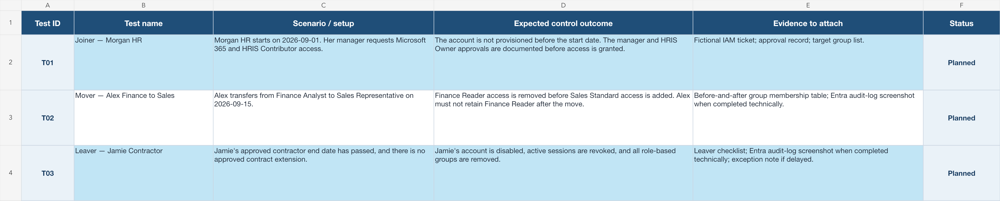
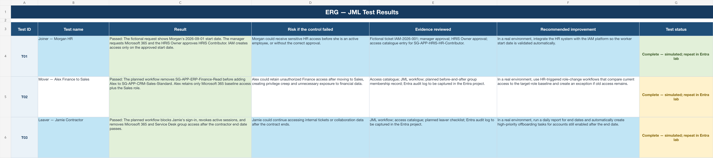

# ERG Joiner–Mover–Leaver Governance and RBAC Design

This project presents a controlled Joiner, Mover, and Leaver process for Energy Retail Group (ERG), a fictional company created for this Identity and Access Management portfolio.

Every identity, application, group, approval, ticket, and test result is fictional. 

## Video Demonstration

[Watch the Project 1 walkthrough on YouTube](https://youtu.be/B3y06oteajU)

The walkthrough explains ERG's Joiner, Mover, and Leaver process, access catalogue, RACI, controls matrix, and simulated test scenarios.

### Project 2 Technical Implementation

[Watch Project 2A: Active Directory and Okta Integration on YouTube](https://youtu.be/YD7xdB5YBTo)

Project 2A continues this governance design by building the fictional ERG Active Directory environment, connecting it to Okta through the Okta Active Directory Agent, importing scoped users and security groups, and preparing group-based access to the ERG Business Portal placeholder.

Project 2B will demonstrate the technical Joiner, Mover, and Leaver workflows using this environment.

## Project at a Glance

| Area | What this project demonstrates |
|---|---|
| Identity lifecycle | Controlled Joiner, Mover, and Leaver processes |
| Authoritative source | HRIS worker records provide trusted identity facts |
| Access model | Role-based access delivered through documented security groups |
| Governance | Approval ownership, RACI, review schedules, and removal triggers |
| Risk reduction | Early access, excessive access, privilege creep, and late offboarding |
| Evidence | Control matrix, test cases, simulated results, and evidence requirements |

## Business Problem

Employees and contractors need access to perform their jobs, but ERG must ensure that access is:

- Activated at the approved time.
- Approved by the correct business or application owner.
- Limited to what the person's role requires.
- Changed when the person changes jobs.
- Removed promptly when employment or a contract ends.
- Verified and supported by evidence.

Without a controlled process, a new employee could receive access too early, a Mover could retain access from a previous department, or a Leaver could continue accessing company resources.

## JML Workflow

The detailed editable workflow is available in [`diagrams/ERG-JML-Workflow.drawio`](diagrams/ERG-JML-Workflow.drawio).

## Authoritative Source and Access Assignment

ERG's HRIS worker record is the authoritative source for identity facts. It provides the official employee identifier, department, job title, manager, employment type, start date, end date, and employment status.

Security groups are not the authoritative source. They are the controlled mechanism used to deliver approved access after the trusted identity facts and required approvals have been checked.

## Test Scenarios

### Morgan Reed — Joiner

Morgan joins the Human Resources department. The process validates the HRIS worker record, approved start date, manager request, and application-owner approval. IAM then assigns the approved baseline and HR access through security groups, verifies the result, and retains evidence.

### Alex Carter — Mover

Alex transfers from Finance to Sales. IAM compares the current access to the new Sales role, removes Finance access first, verifies its removal, and then adds the approved Sales access. This order reduces privilege creep.

### Jamie Brooks — Leaver

Jamie's approved contractor end date passes without an approved extension. IAM blocks sign-in, revokes active sessions where available, removes role-based access, verifies the final state, and retains the disabled account according to the retention policy.

### Access Catalogue and RACI

The access catalogue maps business roles to Entra groups, access levels, approvers, review schedules, and removal triggers. The RACI identifies who is Responsible, Accountable, Consulted, and Informed.

### Controls Matrix

The controls matrix connects each IAM control to the risk it reduces, the evidence that should be retained, the control owner, and the testing method.

### Test Cases and Simulated Results

The test workbook documents the Morgan Joiner, Alex Mover, and Jamie Leaver scenarios. Project 1 results are deliberately labelled as simulated because this project demonstrates governance and process design. Technical implementation evidence using Active Directory and Okta belongs to Project 2.

## Controls Demonstrated

- HRIS worker record used as the authoritative identity source.
- Role-based requests and application-owner approval.
- Group-based access instead of direct individual permissions.
- Removal of previous-department access before adding new access.
- Prompt sign-in blocking and access removal for Leavers.
- Separate approval and expiry requirements for privileged access.
- Evidence retention and repeatable control testing.

## Skills Demonstrated

- Joiner, Mover, and Leaver lifecycle design
- Role-Based Access Control
- Least privilege
- Authoritative-source reasoning
- Approval and ownership design
- Privilege-creep prevention
- Contractor offboarding
- RACI documentation
- Control and risk mapping
- Test-case design
- Evidence planning
- SailPoint lifecycle and provisioning concepts

## AI Use Disclosure

I used AI as a drafting and learning assistant for portions of the synthetic project material and documentation. I reviewed the IAM logic, connected the artifacts, tested my understanding, and can explain the risks, controls, limitations, and expected outcomes demonstrated in this project.

## Privacy and Safety

- ERG and every identity in this project are fictional

